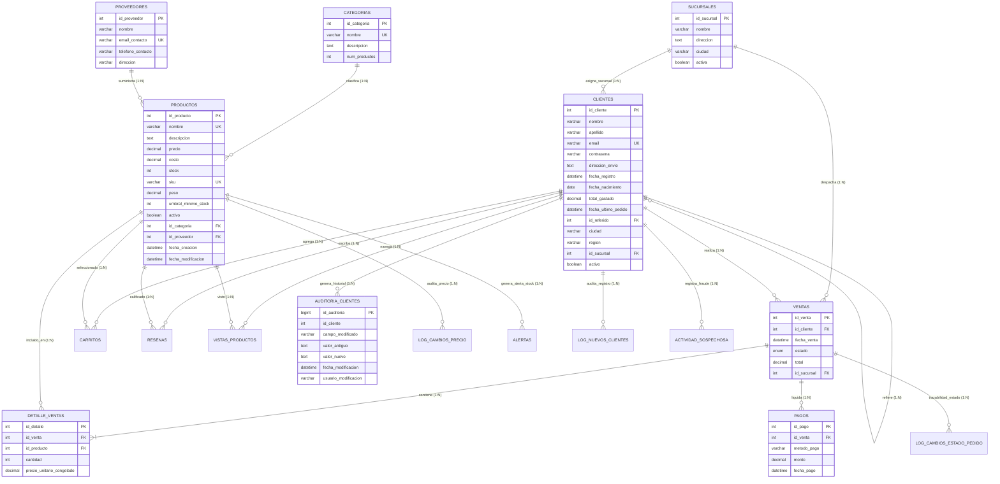

# 🛒 Sistema Empresarial de Base de Datos para E-Commerce (`ecommerce_db`)

**Asignatura:** Bases de Datos II / Bases de Datos Avanzadas  
**Autor:** Juan Camilo Leal Castellanos  
**Motor de Base de Datos:** MySQL 8.0+ (InnoDB Engine, Codificación `utf8mb4`)  
**Entorno de Ejecución:** Docker & Docker Compose  
**Fecha:** Octubre 2026  

---

## 📑 Tabla de Contenidos
1. [Introducción y Alcance del Sistema](#-introducción-y-alcance-del-sistema)
2. [Arquitectura Tecnológica y Estructura del Repositorio](#-arquitectura-tecnológica-y-estructura-del-repositorio)
3. [Diagrama Entidad-Relación Completo (ERD)](#-diagrama-entidad-relación-completo-erd)
4. [Diccionario de Datos Exhaustivo](#-diccionario-de-datos-exhaustivo)
   - [Tablas Principales del Núcleo](#41-tablas-principales-del-núcleo)
   - [Tablas Auxiliares, Operativas y Transaccionales](#42-tablas-auxiliares-operativas-y-transaccionales)
   - [Tablas de Resumen, Reporte y Analítica](#43-tablas-de-resumen-reporte-y-analítica)
   - [Tablas de Auditoría y Seguridad](#44-tablas-de-auditoría-y-seguridad)
5. [Catálogo Tabular de Objetos de Base de Datos (120 Objetos)](#-catálogo-tabular-de-objetos-de-base-de-datos-120-objetos)
   - [20 Consultas Analíticas Avanzadas](#51-20-consultas-analíticas-avanzadas-02_consultas_avanzadassql)
   - [20 Funciones Definidas por el Usuario (UDF)](#52-20-funciones-definidas-por-el-usuario-udf-03_funcionessql)
   - [20 Reglas de Seguridad y RBAC](#53-20-reglas-de-seguridad-roles-y-vistas-04_seguridadsql)
   - [22 Triggers de Automatización e Integridad](#54-22-triggers-de-automatización-e-integridad-05_triggerssql)
   - [20 Eventos Programados](#55-20-eventos-programados-06_eventossql)
   - [20 Procedimientos Almacenados Transaccionales](#56-20-procedimientos-almacenados-07_procedimientos_almacenadossql)
6. [Módulo Especializado de Auditoría de Clientes](#-módulo-especializado-de-auditoría-de-clientes)
7. [Guía de Instalación, Despliegue y Ejecución](#-guía-de-instalación-despliegue-y-ejecución)
8. [Resolución de Auditoría Técnica y Buenas Prácticas](#-resolución-de-auditoría-técnica-y-buenas-prácticas)

---

## 📖 Introducción y Alcance del Sistema

El proyecto **`ecommerce_db`** diseña e implementa el núcleo transaccional, operativo y analítico para una plataforma de comercio electrónico de alta disponibilidad. Su arquitectura garantiza:
- **Integridad Referencial y Dominio Estricto:** Restricciones `CHECK`, claves primarias compuestas y foráneas, e índices optimizados.
- **Transaccionalidad ACID:** Operaciones de venta, inventario y devolución protegidas mediante transacciones explícitas (`START TRANSACTION`, `COMMIT`, `ROLLBACK`) y bloqueos pesimistas (`SELECT ... FOR UPDATE`).
- **Lógica de Negocio Encapsulada:** Desacoplamiento de reglas complejas hacia el motor mediante UDFs, triggers y procedimientos almacenados.
- **Mantenimiento Autónomo y Analítica:** Eventos programados nocturnos y horarios para agregación de KPIs, detección de fraudes y purga de logs.
- **Seguridad en Profundidad (RBAC):** Separación de privilegios basada en 7 roles, vistas de enmascaramiento de datos personales (PII) y políticas de contraseñas.

---

## 🏗️ Arquitectura Tecnológica y Estructura del Repositorio

El sistema está empaquetado para despliegue automatizado en contenedores Docker y organizado modularmente:

```
📁 Proyecto_BD_Avanzada/
├── 📄 docker-compose.yml                  ← Orquestación de MySQL 8.0 y phpMyAdmin
├── 📄 README.md                           ← Documentación técnica integral
├── 📄 01_Esquema_y_Datos.sql              ← DDL base (30+ tablas), restricciones e inserción de datos
├── 📄 02_Consultas_Avanzadas.sql          ← 20 consultas analíticas (CTEs, Window Functions)
├── 📄 03_Funciones.sql                    ← 20 funciones UDF de negocio
├── 📄 04_Seguridad.sql                    ← 7 roles, 4 usuarios, vistas seguras y privilegios
├── 📄 05_Triggers.sql                     ← 22 triggers de auditoría, stock e integridad
├── 📄 06_Eventos.sql                      ← 20 eventos calendarizados con Event Scheduler
├── 📄 07_Procedimientos_Almacenados.sql   ← 20 procedimientos transaccionales
├── 📁 sql/
│   └── 📄 08_auditoria_clientes.sql       ← Módulo entregable de Auditoria_Clientes
├── 📁 tests/
│   ├── 📄 00_fixture_clientes.sql         ← Fixture aislado de pruebas
│   └── 📄 02_tests_trigger.sql            ← Batería de 20 casos de prueba (100% PASS)
└── 📁 docs/
    ├── 📄 diseno.md                       ← Arquitectura del log de auditoría
    ├── 📄 auditoria.md                    ← Reporte de auditoría de código y seguridad
    └── 📄 evidencia_pruebas.md            ← Registro crudo de ejecución en MySQL 8
```

---

## 🗺️ Diagrama Entidad-Relación Completo (ERD)

A continuación se presenta el modelo relacional completo de las 30 entidades que conforman la base de datos:



---

## 📚 Diccionario de Datos Exhaustivo

### 4.1. Tablas Principales del Núcleo

#### Tabla: `categorias`
Clasificación taxonómica de productos en el catálogo.

| Campo | Tipo | Nulo | Clave | Default | Restricciones / Comentarios |
|---|---|:---:|:---:|---|---|
| `id_categoria` | INT | NO | PK | AUTO_INCREMENT | Identificador numérico único de categoría. |
| `nombre` | VARCHAR(100) | NO | UK | - | Nombre único de la categoría (ej. 'Electrónica'). |
| `descripcion` | TEXT | SÍ | - | NULL | Detalle descriptivo de los artículos del rubro. |
| `num_productos` | INT | NO | - | 0 | Conteo de productos activos (gestionado por triggers). |

#### Tabla: `proveedores`
Empresas y entidades distribuidoras que suministran los artículos.

| Campo | Tipo | Nulo | Clave | Default | Restricciones / Comentarios |
|---|---|:---:|:---:|---|---|
| `id_proveedor` | INT | NO | PK | AUTO_INCREMENT | Identificador único del proveedor. |
| `nombre` | VARCHAR(150) | NO | - | - | Razón social o nombre comercial. |
| `email_contacto` | VARCHAR(200) | NO | UK | - | Correo principal de contacto comercial. |
| `telefono_contacto` | VARCHAR(50) | SÍ | - | NULL | Línea telefónica directa de contacto. |
| `direccion` | TEXT | SÍ | - | NULL | Domicilio fiscal o de almacén de distribución. |

#### Tabla: `sucursales`
Puntos de venta y centros de distribución física.

| Campo | Tipo | Nulo | Clave | Default | Restricciones / Comentarios |
|---|---|:---:|:---:|---|---|
| `id_sucursal` | INT | NO | PK | AUTO_INCREMENT | Identificador de sucursal. |
| `nombre` | VARCHAR(100) | NO | - | - | Nombre distintivo (ej. 'Sucursal Norte, Monterrey'). |
| `direccion` | TEXT | SÍ | - | NULL | Dirección del punto logístico. |
| `ciudad` | VARCHAR(100) | SÍ | - | NULL | Ciudad donde radica la sucursal. |
| `activa` | BOOLEAN | SÍ | - | TRUE | Estado operativo de la sucursal. |

#### Tabla: `productos`
Artículos comercializados con control de costo, precio e inventario.

| Campo | Tipo | Nulo | Clave | Default | Restricciones / Comentarios |
|---|---|:---:|:---:|---|---|
| `id_producto` | INT | NO | PK | AUTO_INCREMENT | Identificador numérico único de producto. |
| `nombre` | VARCHAR(200) | NO | UK | - | Nombre comercial del artículo. |
| `descripcion` | TEXT | SÍ | - | NULL | Ficha técnica y características del artículo. |
| `precio` | DECIMAL(10,2) | NO | - | - | `CHECK (precio > 0)`. Valor de venta al público. |
| `costo` | DECIMAL(10,2) | NO | - | - | `CHECK (costo >= 0)`. Costo de adquisición. |
| `stock` | INT | NO | - | 0 | `CHECK (stock >= 0)`. Unidades en existencia. |
| `sku` | VARCHAR(50) | NO | UK | - | Stock Keeping Unit único de almacén. |
| `peso` | DECIMAL(8,2) | SÍ | - | 0.00 | Peso en kilogramos (para cálculo de flete). |
| `umbral_minimo_stock` | INT | SÍ | - | 10 | Límite para disparar alertas de reabastecimiento. |
| `activo` | BOOLEAN | SÍ | - | TRUE | Visibilidad en vitrina y disponibilidad. |
| `id_categoria` | INT | SÍ | FK | NULL | Referencia `categorias(id_categoria)`. |
| `id_proveedor` | INT | SÍ | FK | NULL | Referencia `proveedores(id_proveedor)`. |
| `fecha_creacion` | DATETIME | SÍ | - | CURRENT_TIMESTAMP | Fecha de alta en el sistema. |
| `fecha_modificacion` | DATETIME | SÍ | - | CURRENT_TIMESTAMP | Actualizado en cada UPDATE por motor. |

#### Tabla: `clientes`
Usuarios registrados en la plataforma.

| Campo | Tipo | Nulo | Clave | Default | Restricciones / Comentarios |
|---|---|:---:|:---:|---|---|
| `id_cliente` | INT | NO | PK | AUTO_INCREMENT | Identificador del cliente. |
| `nombre` | VARCHAR(100) | NO | - | - | Nombre de pila. |
| `apellido` | VARCHAR(100) | NO | - | - | Apellidos del usuario. |
| `email` | VARCHAR(200) | NO | UK | - | Correo y login único del cliente. |
| `contraseña` | VARCHAR(255) | NO | - | - | Hash criptográfico (SHA-256) de la credencial. |
| `direccion_envio` | TEXT | SÍ | - | NULL | Dirección predeterminada de despacho. |
| `fecha_registro` | DATETIME | SÍ | - | CURRENT_TIMESTAMP | Timestamp de creación de la cuenta. |
| `fecha_nacimiento` | DATE | SÍ | - | NULL | Utilizado para promociones y saludos. |
| `total_gastado` | DECIMAL(12,2) | SÍ | - | 0.00 | Gasto histórico acumulado (LTV). |
| `fecha_ultimo_pedido` | DATETIME | SÍ | - | NULL | Fecha de la orden completada más reciente. |
| `id_referido` | INT | SÍ | FK | NULL | Auto-referencia hacia `clientes(id_cliente)`. |
| `ciudad` | VARCHAR(100) | SÍ | - | NULL | Ciudad del cliente. |
| `region` | VARCHAR(100) | SÍ | - | NULL | Región / Estado para estimación de fletes. |
| `id_sucursal` | INT | SÍ | FK | 1 | Referencia `sucursales(id_sucursal)`. |
| `activo` | BOOLEAN | SÍ | - | TRUE | Estado de la cuenta de usuario. |

#### Tabla: `ventas`
Encabezado de órdenes de compra y transacciones.

| Campo | Tipo | Nulo | Clave | Default | Restricciones / Comentarios |
|---|---|:---:|:---:|---|---|
| `id_venta` | INT | NO | PK | AUTO_INCREMENT | Identificador de la transacción. |
| `id_cliente` | INT | NO | FK | - | Referencia `clientes(id_cliente)`. |
| `fecha_venta` | DATETIME | SÍ | IDX | CURRENT_TIMESTAMP | Timestamp de confirmación de la venta. |
| `estado` | ENUM | NO | IDX | 'Pendiente de Pago' | Valores: 'Pendiente de Pago', 'Procesando', 'Enviado', 'Entregado', 'Cancelado', 'Pagado', 'Devuelto'. |
| `total` | DECIMAL(12,2) | SÍ | - | 0.00 | Monto final de la venta calculado por detalles. |
| `id_sucursal` | INT | SÍ | FK | 1 | Referencia `sucursales(id_sucursal)`. |

#### Tabla: `detalle_ventas`
Líneas de pedido que asocian artículos con transacciones.

| Campo | Tipo | Nulo | Clave | Default | Restricciones / Comentarios |
|---|---|:---:|:---:|---|---|
| `id_detalle` | INT | NO | PK | AUTO_INCREMENT | Identificador único de línea de venta. |
| `id_venta` | INT | NO | FK | - | Referencia `ventas(id_venta)`. |
| `id_producto` | INT | NO | FK | - | Referencia `productos(id_producto)`. |
| `cantidad` | INT | NO | - | - | `CHECK (cantidad > 0)`. Unidades compradas. |
| `precio_unitario_congelado` | DECIMAL(10,2) | NO | - | - | Precio histórico al momento exacto de la orden. |

---

### 4.2. Tablas Auxiliares, Operativas y Transaccionales

#### Tabla: `pagos`
Registro y conciliación de liquidación de ventas.

| Campo | Tipo | Nulo | Clave | Default | Restricciones / Comentarios |
|---|---|:---:|:---:|---|---|
| `id_pago` | INT | NO | PK | AUTO_INCREMENT | Identificador único de pago. |
| `id_venta` | INT | NO | FK | - | Referencia `ventas(id_venta)`. |
| `metodo_pago` | VARCHAR(50) | NO | - | - | Medio utilizado (Tarjeta, SPEI, PayPal). |
| `monto` | DECIMAL(12,2) | NO | - | - | Importe exacto cobrado. |
| `fecha_pago` | DATETIME | SÍ | - | CURRENT_TIMESTAMP | Timestamp de procesamiento del pago. |

#### Tabla: `carritos`
Artículos reservados temporalmente por clientes.

| Campo | Tipo | Nulo | Clave | Default | Restricciones / Comentarios |
|---|---|:---:|:---:|---|---|
| `id_carrito` | INT | NO | PK | AUTO_INCREMENT | Identificador de línea en carrito. |
| `id_cliente` | INT | NO | FK | - | Referencia `clientes(id_cliente)`. |
| `id_producto` | INT | NO | FK | - | Referencia `productos(id_producto)`. |
| `cantidad` | INT | NO | - | 1 | Unidades seleccionadas en la sesión. |
| `fecha_agregado` | DATETIME | SÍ | - | CURRENT_TIMESTAMP | Fecha de incorporación al carrito. |
| `completado` | BOOLEAN | SÍ | - | FALSE | Indica si culminó en orden completada. |

#### Tabla: `promociones`
Campañas de descuento con vigencia temporal.

| Campo | Tipo | Nulo | Clave | Default | Restricciones / Comentarios |
|---|---|:---:|:---:|---|---|
| `id_promocion` | INT | NO | PK | AUTO_INCREMENT | Identificador de la campaña. |
| `nombre` | VARCHAR(150) | NO | - | - | Nombre comercial de la campaña. |
| `porcentaje_descuento` | DECIMAL(5,2) | NO | - | - | Porcentaje aplicado (ej. 15.00%). |
| `fecha_inicio` | DATE | NO | - | - | Inicio de vigencia. |
| `fecha_fin` | DATE | NO | - | - | Fin de vigencia. |
| `codigo` | VARCHAR(50) | SÍ | UK | NULL | Cupón de canje único. |
| `activa` | BOOLEAN | SÍ | - | TRUE | Estado de activación. |

#### Tabla: `resenas`
Valoraciones y opiniones de clientes sobre productos adquiridos.

| Campo | Tipo | Nulo | Clave | Default | Restricciones / Comentarios |
|---|---|:---:|:---:|---|---|
| `id_resena` | INT | NO | PK | AUTO_INCREMENT | Identificador de la reseña. |
| `id_producto` | INT | NO | FK | - | Referencia `productos(id_producto)`. |
| `id_cliente` | INT | NO | FK | - | Referencia `clientes(id_cliente)`. |
| `calificacion` | INT | NO | - | - | `CHECK (calificacion BETWEEN 1 AND 5)`. Estrellas. |
| `comentario` | TEXT | SÍ | - | NULL | Texto con la opinión del comprador. |
| `fecha_resena` | DATETIME | SÍ | - | CURRENT_TIMESTAMP | Fecha de publicación. |

#### Tabla: `vistas_productos`
Registro de visitas e impresiones para cálculo de conversión.

| Campo | Tipo | Nulo | Clave | Default | Restricciones / Comentarios |
|---|---|:---:|:---:|---|---|
| `id_vista` | INT | NO | PK | AUTO_INCREMENT | Identificador de vista. |
| `id_producto` | INT | NO | FK | - | Referencia `productos(id_producto)`. |
| `id_cliente` | INT | SÍ | FK | NULL | Cliente que vio el producto (o anónimo). |
| `fecha_vista` | DATETIME | SÍ | - | CURRENT_TIMESTAMP | Timestamp de la consulta de producto. |

#### Tabla: `tasas_cambio`
Conversión multidivisa para transacciones internacionales.

| Campo | Tipo | Nulo | Clave | Default | Restricciones / Comentarios |
|---|---|:---:|:---:|---|---|
| `id_tasa` | INT | NO | PK | AUTO_INCREMENT | Identificador de tasa. |
| `moneda_origen` | VARCHAR(3) | NO | - | 'USD' | Código ISO de moneda base. |
| `moneda_destino` | VARCHAR(3) | NO | - | - | Código ISO de moneda destino (EUR, MXN, etc.). |
| `tasa` | DECIMAL(10,4) | NO | - | - | Factor de conversión cambiaria. |
| `fecha_actualizacion` | DATETIME | SÍ | - | CURRENT_TIMESTAMP | Última cotización registrada. |

---

### 4.3. Tablas de Resumen, Reporte y Analítica

| Tabla | Propósito | Columnas Principales | Periodicidad / Origen |
|---|---|---|---|
| `resumen_ventas_diarias` | Vista materializada simulada de facturación diaria | `id_resumen`, `fecha`, `total_ventas`, `num_transacciones`, `num_productos_vendidos` | Diario (23:59h vía Event Scheduler) |
| `reporte_ventas_semanales` | Consolidación semanal para gerencia comercial | `id_reporte`, `fecha_inicio`, `fecha_fin`, `total_ventas`, `num_transacciones` | Semanal (Lunes 00:00h) |
| `ranking_productos` | Tabla de clasificación por ingresos y volumen | `id_ranking`, `id_producto`, `total_vendido`, `ingresos_generados`, `posicion` | Horario (vía `ROW_NUMBER()`) |
| `kpis_mensuales` | Indicadores ejecutivos de negocio (ticket, margen) | `id_kpi`, `anio`, `mes`, `ventas_totales`, `ticket_promedio`, `margen_promedio` | Mensual (Día 1 de cada mes) |
| `reporte_rendimiento_proveedores` | Evaluación de proveedores por facturación | `id_proveedor`, `total_productos`, `total_unidades_vendidas`, `ingresos_generados` | Mensual |
| `log_tamano_bd` | Monitoreo de infraestructura y crecimiento físico | `nombre_tabla`, `tamano_datos_mb`, `tamano_indice_mb`, `num_filas` | Semanal |
| `actividad_sospechosa` | Detección de patrones fraudulentos de cancelación | `id_cliente`, `tipo_actividad`, `descripcion`, `fecha_deteccion` | Horario (evaluación ventana 24h) |

---

### 4.4. Tablas de Auditoría y Seguridad

#### Tabla: `Auditoria_Clientes` (Módulo Entregable)
Bitácora inmutable de cambios en datos sensibles de clientes (`email`, `direccion_envio`).

| Campo | Tipo | Nulo | Clave | Default | Restricciones / Comentarios |
|---|---|:---:|:---:|---|---|
| `id_auditoria` | BIGINT | NO | PK | AUTO_INCREMENT | Evita desbordamiento en auditorías de gran escala. |
| `id_cliente` | INT | NO | IDX | - | Sin FK restrictiva (permanece tras borrado de cliente). |
| `campo_modificado` | VARCHAR(50) | NO | - | - | Nombre exacto del campo (`email` o `direccion_envio`). |
| `valor_antiguo` | TEXT | SÍ | - | NULL | Contenido previo a la modificación (soporta textos largos). |
| `valor_nuevo` | TEXT | SÍ | - | NULL | Contenido nuevo posterior a la modificación. |
| `fecha_modificacion` | DATETIME | SÍ | IDX | CURRENT_TIMESTAMP | Timestamp exacto del suceso. |
| `usuario_modificacion` | VARCHAR(255) | SÍ | - | CURRENT_USER() | Identidad del usuario de base de datos o API. |

#### Tablas de Auditoría Complementarias:
- `log_cambios_precio`: Auditoría automática de variaciones de precios (trigger AFTER UPDATE en productos).
- `log_nuevos_clientes`: Registro cronológico de altas de usuarios en la tienda.
- `log_cambios_estado_pedido`: Trazabilidad de transiciones de estados en ventas.
- `alertas`: Notificaciones de stock bajo o inconsistencias de datos para administradores.
- `ventas_archivo`: Tabla histórica con PK autoincremental para ventas eliminadas o purgadas.
- `log_permisos`: Bitácora administrativa para registrar concesiones y revocaciones de privilegios.

---

## 🎯 Catálogo Tabular de Objetos de Base de Datos (120 Objetos)

### 5.1. 20 Consultas Analíticas Avanzadas (`02_Consultas_Avanzadas.sql`)

| # | Consulta de Negocio | Enfoque y Complejidad Técnica | Cláusulas Clave |
|:---:|---|---|---|
| 1 | Top 10 Productos Más Vendidos | Ranking por facturación total | `SUM()`, `JOIN`, `ORDER BY DESC`, `LIMIT 10` |
| 2 | Productos con Bajas Ventas (Bottom 10%) | Segmentación de artículos de menor rotación | Función de ventana `NTILE(10) OVER()` o `PERCENT_RANK()` |
| 3 | Clientes VIP por Lifetime Value (LTV) | Top 5 compradores históricos descartando cancelaciones | `SUM()`, `JOIN clientes`, `WHERE estado NOT IN`, `LIMIT 5` |
| 4 | Análisis de Ventas Mensuales | Agrupación temporal y tendencia anual | `YEAR()`, `MONTH()`, `SUM(total)`, `GROUP BY` |
| 5 | Crecimiento Trimestral de Clientes | Adquisición de nuevos usuarios por trimestre | `QUARTER()`, `YEAR()`, `COUNT(*)` |
| 6 | Tasa de Compra Repetida | Porcentaje de clientes con más de una transacción | Subconsultas escalares, `COUNT(DISTINCT)` |
| 7 | Productos Comprados Juntos | Detección de pares en transacciones comunes (Market Basket) | Auto-join `detalle_ventas dv1 JOIN detalle_ventas dv2` |
| 8 | Rotación de Inventario | Ratio de rotación de stock por categoría | CTE `WITH`, desacoplamiento de ventas y promedio de stock |
| 9 | Reabastecimiento Crítico | Artículos por debajo de su umbral mínimo de stock | `WHERE stock < umbral_minimo_stock`, `JOIN proveedores` |
| 10 | Análisis de Carrito Abandonado | Clientes con ítems sin comprar con más de 7 días | `WHERE completado = FALSE AND DATEDIFF() > 7` |
| 11 | Rendimiento de Proveedores | Clasificación por volumen facturado de sus productos | `JOIN proveedores->productos->detalle_ventas` |
| 12 | Análisis Geográfico de Ventas | Distribución territorial de ingresos | `GROUP BY clientes.ciudad, clientes.region` |
| 13 | Ventas por Hora del Día | Identificación de horas pico para campañas de marketing | `HOUR(fecha_venta)`, `COUNT(*)`, `SUM(total)` |
| 14 | Impacto de Promociones | Comparación de ventas antes, durante y después de promos | `CASE WHEN fecha BETWEEN`, subconsultas condicionales |
| 15 | Análisis de Cohorte (Cohort Retention) | Retención mensual desde el primer mes de compra | CTE recursiva / particionamiento de clientes por fecha inicial |
| 16 | Margen de Beneficio por Producto | Cálculo de ganancia bruta porcentual y total | `((precio - costo) / precio * 100)`, margen total |
| 17 | Tiempo Promedio Entre Compras | Cadencia entre transacciones por cliente | Función de ventana `LAG() OVER(PARTITION BY id_cliente)` |
| 18 | Productos Más Vistos vs. Comprados | Conversión de visualizaciones a compras | `LEFT JOIN vistas_productos` vs `detalle_ventas` |
| 19 | Segmentación RFM de Clientes | Clasificación por Recencia, Frecuencia y Monetario | `NTILE(5) OVER()`, `DATEDIFF(NOW(), MAX(fecha))` |
| 20 | Predicción Simple de Demanda | Proyección mediante promedio móvil de los últimos meses | Window function `ROWS BETWEEN 2 PRECEDING AND CURRENT` |

---

### 5.2. 20 Funciones Definidas por el Usuario (UDF) (`03_Funciones.sql`)

| # | Nombre de la Función | Parámetros | Retorno | Lógica y Regla de Negocio Encapsulada |
|:---:|---|---|:---:|---|
| 1 | `fn_CalcularTotalVenta` | `p_id_venta INT` | `DECIMAL(12,2)` | Suma `cantidad * precio_unitario_congelado` de detalle_ventas. |
| 2 | `fn_VerificarDisponibilidadStock` | `p_id_producto INT, p_cant INT` | `BOOLEAN` | Valida si `stock >= p_cant` en la tabla productos. |
| 3 | `fn_ObtenerPrecioProducto` | `p_id_producto INT` | `DECIMAL(10,2)` | Retorna el precio vigente de catálogo. |
| 4 | `fn_CalcularEdadCliente` | `p_id_cliente INT` | `INT` | Calcula la edad con `TIMESTAMPDIFF(YEAR, fecha_nacimiento, CURDATE())`. |
| 5 | `fn_FormatearNombreCompleto` | `p_id_cliente INT` | `VARCHAR(255)` | Retorna `'Apellido, Nombre'` con buffer ampliado anti-truncamiento. |
| 6 | `fn_EsClienteNuevo` | `p_id_cliente INT` | `BOOLEAN` | Valida si la primera orden fue en los últimos 30 días. |
| 7 | `fn_CalcularCostoEnvio` | `p_id_venta INT` | `DECIMAL(10,2)` | Tarifa escalonada basada en peso total acumulado (`base + peso*5`). |
| 8 | `fn_AplicarDescuento` | `p_monto DEC, p_porc DEC` | `DECIMAL(12,2)` | Aplica descuento porcentual validando rango `[0, 100]`. |
| 9 | `fn_ObtenerUltimaFechaCompra` | `p_id_cliente INT` | `DATETIME` | Consulta `MAX(fecha_venta)` excluyendo canceladas. |
| 10 | `fn_ValidarFormatoEmail` | `p_email VARCHAR` | `BOOLEAN` | Validación estricta con expresión regular `REGEXP`. |
| 11 | `fn_ObtenerNombreCategoria` | `p_id_producto INT` | `VARCHAR(100)` | Retorna el nombre de la categoría del producto. |
| 12 | `fn_ContarVentasCliente` | `p_id_cliente INT` | `INT` | Total de órdenes no canceladas realizadas por un cliente. |
| 13 | `fn_CalcularDiasDesdeUltimaCompra` | `p_id_cliente INT` | `INT` | Días transcurridos con `DATEDIFF(NOW(), MAX(fecha_venta))`. |
| 14 | `fn_DeterminarEstadoLealtad` | `p_id_cliente INT` | `VARCHAR(10)` | Clasifica en Oro (>10k), Plata (>5k) o Bronce (<=5k). |
| 15 | `fn_GenerarSKU` | `p_nombre VARCHAR, p_cat INT` | `VARCHAR(50)` | Genera código único combinando prefijos y valor aleatorio. |
| 16 | `fn_CalcularIVA` | `p_monto DECIMAL` | `DECIMAL(12,2)` | Calcula el 16% de IVA sobre un monto gravable. |
| 17 | `fn_ObtenerStockTotalPorCategoria`| `p_id_categoria INT` | `INT` | Suma el stock de todos los artículos activos en una categoría. |
| 18 | `fn_EstimarFechaEntrega` | `p_id_venta INT` | `DATE` | Días estimados por región (+3 CDMX, +5 EdoMex, +7 otras). |
| 19 | `fn_ConvertirMoneda` | `p_monto DEC, p_moneda VARCHAR`| `DECIMAL(12,2)` | Aplica factor cambiario desde la tabla `tasas_cambio`. |
| 20 | `fn_ValidarComplejidadContrasena`| `p_pass VARCHAR` | `BOOLEAN` | Valida longitud >= 8, mayúsculas, minúsculas, números y símbolos. |

---

### 5.3. 20 Reglas de Seguridad, Roles y Vistas (`04_Seguridad.sql`)

| # | Objeto / Regla de Seguridad | Tipo | Permisos / Acciones | Propósito y Justificación de Seguridad |
|:---:|---|:---:|---|---|
| 1 | `Administrador_Sistema` | ROL | `ALL PRIVILEGES WITH GRANT OPTION` | Control total del esquema y administración global. |
| 2 | `Gerente_Marketing` | ROL | `SELECT` en ventas, detalles, clientes, productos | Consulta de métricas comerciales sin alterar registros. |
| 3 | `Analista_Datos` | ROL | `SELECT` en tablas excepto logs de auditoría | Análisis analítico respetando la privacidad de auditoría. |
| 4 | `Empleado_Inventario` | ROL | `SELECT` + `UPDATE (stock, peso, umbral)` | Seguridad a nivel de columna: bloquea alteración de precios. |
| 5 | `Atencion_Cliente` | ROL | `SELECT` en ventas, detalles, productos, vista básica | Bloqueo estricto de tabla base `clientes` (protege hash y dirección). |
| 6 | `Auditor_Financiero` | ROL | `SELECT` en ventas, detalles, productos, log precios | Inspección financiera y trazabilidad de ingresos. |
| 7 | `admin_user` | USUARIO | Rol `Administrador_Sistema` asignado por defecto | Usuario administrativo con autenticación fuerte. |
| 8 | `marketing_user` | USUARIO | Rol `Gerente_Marketing` asignado | Operador de análisis y campañas de marketing. |
| 9 | `inventory_user` | USUARIO | Rol `Empleado_Inventario` asignado | Operador de almacén y entradas de inventario. |
| 10 | `support_user` | USUARIO | Rol `Atencion_Cliente` asignado | Agente de soporte con acceso restringido. |
| 11 | Protección contra DELETE/TRUNCATE | REGLA | Ausencia intencional de privilegios destructivos | Principio de menor privilegio aplicado a analistas. |
| 12 | Privilegio de Procedimientos | GRANT | `EXECUTE ON PROCEDURE sp_GenerarReporteMensualVentas` | Ejecución controlada de reportes para gerencia. |
| 13 | `v_info_clientes_basica` | VISTA | Oculta `contraseña` y `direccion_envio` | Enmascaramiento de datos personales sensibles (PII). |
| 14 | Restricción de precio en almacén | REGLA | Exclusión de columna `precio` en GRANT a inventario | Previene fraude o manipulación interna de tarifas. |
| 15 | Política de Rotación y Bloqueo | ALTER USER | Expira cada 90 días, bloquea tras 3 fallos (1 día) | Mitigación contra ataques de fuerza bruta y contraseñas estancadas. |
| 16 | Restricción de Host para Root | REGLA | Root restringido a localhost en producción | Cierra acceso administrativo directo desde redes no autorizadas. |
| 17 | `Visitante` / `v_productos_publicos` | ROL/VISTA | Solo productos activos, oculta costo de proveedor | Acceso público para catálogo web protegiendo márgenes comerciales. |
| 18 | Límite de Recursos (Throttling) | RECURSO | `WITH MAX_QUERIES_PER_HOUR 1000` en analistas | Prevención de denegación de servicio (DoS) por consultas pesadas. |
| 19 | `v_ventas_sucursal` | VISTA | Filtra ventas por la sucursal de la sesión actual | Implementación de Row-Level Security (RLS) mediante UDF de sesión. |
| 20 | Auditoría de Intentos Fallidos | REGLA | Tabla `log_intentos_login` y directivas de login | Registro de accesos para análisis forense de seguridad. |

---

### 5.4. 22 Triggers de Automatización e Integridad (`05_Triggers.sql`)

| # | Nombre del Trigger | Tabla | Momento / Evento | Acción Realizada e Impacto en Datos |
|:---:|---|---|:---:|---|
| 1 | `trg_audit_precio_producto_after_update` | `productos` | AFTER UPDATE | Registra en `log_cambios_precio` si `OLD.precio != NEW.precio`. |
| 2 | `trg_check_stock_before_insert_venta` | `detalle_ventas` | BEFORE INSERT | Falla con `SIGNAL 45000` si `stock < cantidad`. |
| 3 | `trg_update_stock_after_insert_venta` | `detalle_ventas` | AFTER INSERT | Descuenta automáticamente del inventario (`stock = stock - NEW.cantidad`). |
| 3b | `trg_restore_stock_after_delete_detalle` | `detalle_ventas` | AFTER DELETE | Restaura stock automáticamente (`stock = stock + OLD.cantidad`). |
| 3c | `trg_adjust_stock_after_update_detalle` | `detalle_ventas` | AFTER UPDATE | Ajusta stock ante cambios en la cantidad de una orden. |
| 4 | `trg_prevent_delete_categoria_with_products`| `categorias` | BEFORE DELETE | Impide borrar categorías que contengan artículos asignados. |
| 5 | `trg_log_new_customer_after_insert` | `clientes` | AFTER INSERT | Registra alta en `log_nuevos_clientes`. |
| 6 | `trg_update_total_gastado_cliente` | `detalle_ventas` | AFTER INSERT | Acumula en `clientes.total_gastado` solo si la orden es válida. |
| 7 | `trg_set_fecha_modificacion_producto` | `productos` | BEFORE UPDATE | Asegura timestamp actualizado (defensa en profundidad). |
| 8 | `trg_prevent_negative_stock` | `productos` | BEFORE UPDATE | Bloquea inventarios negativos con mensaje descriptivo. |
| 9 | `trg_capitalize_nombre_cliente` | `clientes` | BEFORE INSERT | Formatea nombres y apellidos con mayúscula inicial automáticamente. |
| 10 | `trg_recalculate_total_venta_on_detalle_change`| `detalle_ventas`| AFTER UPDATE | Recalcula el total de la venta si se altera una línea de detalle. |
| 11 | `trg_log_order_status_change` | `ventas` | AFTER UPDATE | Registra transición de estado en `log_cambios_estado_pedido`. |
| 12 | `trg_prevent_price_zero_or_less` | `productos` | BEFORE INSERT | Falla con error descriptivo si precio <= 0 (defensa en profundidad). |
| 13 | `trg_send_stock_alert_on_low_stock` | `productos` | AFTER UPDATE | Inserta alerta en `alertas` si stock cae bajo el umbral mínimo. |
| 14 | `trg_archive_deleted_venta` | `ventas` | BEFORE DELETE | Mueve registro a `ventas_archivo` con PK autoincremental antes de eliminar. |
| 15a | `trg_validate_email_format_on_customer_insert`| `clientes` | BEFORE INSERT | Valida sintaxis RFC de correo electrónico en altas. |
| 15b | `trg_validate_email_format_on_customer_update`| `clientes` | BEFORE UPDATE | Valida sintaxis RFC de correo electrónico en modificaciones. |
| 16 | `trg_update_last_order_date_customer` | `ventas` | AFTER INSERT | Actualiza `fecha_ultimo_pedido` del cliente al confirmar venta. |
| 17 | `trg_prevent_self_referral_insert` | `clientes` | BEFORE INSERT | Impide que un cliente se autorefiera (`id_referido = id_cliente`). |
| 17b | `trg_prevent_self_referral_update` | `clientes` | BEFORE UPDATE | Impide auto-referencia en modificaciones de cliente. |
| 20 | `trg_update_cat_count_after_update_producto` | `productos` | AFTER UPDATE | Incrementa/decrementa `num_productos` al cambiar de categoría. |

---

### 5.5. 20 Eventos Programados (`06_Eventos.sql`)

| # | Nombre del Evento | Frecuencia / Schedule | Tabla Impactada | Objetivo Operativo o Analítico |
|:---:|---|---|---|---|
| 1 | `evt_generate_weekly_sales_report` | Cada 1 semana (Lunes) | `reporte_ventas_semanales` | Consolidación gerencial de facturación de la semana anterior. |
| 2 | `evt_cleanup_temp_tables_daily` | Cada 1 día (05:00h) | Tablas temporales | Limpieza de tablas temporales residuales de reportes. |
| 3 | `evt_archive_old_logs_monthly` | Cada 1 mes | Logs de auditoría | Purga logs de precios y estados con más de 6 meses de antigüedad. |
| 4 | `evt_deactivate_expired_promotions_hourly` | Cada 1 hora | `promociones` | Apaga automáticamente (`activa = FALSE`) promociones expiradas. |
| 5 | `evt_recalculate_customer_loyalty_tiers_nightly`| Cada 1 día (02:00h)| `clientes` | Actualiza la categoría de fidelización según gasto histórico. |
| 6 | `evt_generate_reorder_list_daily` | Cada 1 día (06:00h) | `alertas` | Genera órdenes de sugerencia para artículos bajo stock mínimo. |
| 7 | `evt_rebuild_indexes_weekly` | Cada 1 semana (Domingo) | Catálogo InnoDB | Ejecuta `ANALYZE TABLE` para actualizar estadísticas del optimizador. |
| 8 | `evt_suspend_inactive_accounts_quarterly` | Cada 3 meses | `clientes` | Desactiva clientes sin compras ni actividad en más de 1 año. |
| 9 | `evt_aggregate_daily_sales_data` | Cada 1 día (23:59h) | `resumen_ventas_diarias` | Agrega ventas, transacciones y unidades del día (desacoplado sin inflar). |
| 10 | `evt_check_data_consistency_nightly` | Cada 1 día (03:00h) | `alertas` | Detecta ventas huérfanas sin líneas de detalle asociadas. |
| 11 | `evt_send_birthday_greetings_daily` | Cada 1 día (08:00h) | `alertas` | Genera recordatorios comerciales para clientes que cumplen años hoy. |
| 12 | `evt_update_product_rankings_hourly` | Cada 1 hora | `ranking_productos` | Actualiza ranking mediante función de ventana `ROW_NUMBER()`. |
| 13 | `evt_backup_critical_tables_daily` | Cada 1 día (01:00h) | Tablas de backup | Simula respaldo snapshot diario de catálogo e inventario. |
| 14 | `evt_clear_abandoned_carts_daily` | Cada 1 día (04:00h) | `carritos` | Elimina ítems en carritos no comprados con más de 72 horas. |
| 15 | `evt_calculate_monthly_kpis` | Cada 1 mes (Día 1) | `kpis_mensuales` | Calcula ticket promedio, ventas totales y margen del mes cerrado. |
| 16 | `evt_refresh_materialized_views_nightly`| Cada 1 día (02:30h)| `resumen_ventas_diarias` | Recalcula la vista materializada de los últimos 30 días de forma atómica. |
| 17 | `evt_log_database_size_weekly` | Cada 1 semana | `log_tamano_bd` | Registra el peso en megabytes de datos e índices por tabla. |
| 18 | `evt_detect_fraudulent_activity_hourly` | Cada 1 hora | `actividad_sospechosa` | Alerta sobre usuarios con >5 cancelaciones en 24h sin duplicar avisos. |
| 19 | `evt_generate_supplier_performance_report_monthly`| Cada 1 mes | `reporte_rendimiento_proveedores`| Genera reporte mensual de unidades y facturación por proveedor. |
| 20 | `evt_purge_soft_deleted_records_weekly`| Cada 1 semana | `ventas_archivo` | Elimina definitivamente ventas archivadas con más de 30 días. |

---

### 5.6. 20 Procedimientos Almacenados (`07_Procedimientos_Almacenados.sql`)

| # | Nombre del Procedimiento | Parámetros (IN/OUT) | Transaccionalidad / ACID | Operación que Ejecuta |
|:---:|---|---|:---:|---|
| 1 | `sp_RealizarNuevaVenta` | `p_id_cliente, p_id_sucursal, p_productos JSON` | Transacción con `ORDER BY id_producto ASC` y `FOR UPDATE` | Procesa orden completa de múltiples productos vía JSON evitando deadlocks. |
| 2 | `sp_AgregarNuevoProducto` | `p_nombre, p_precio, p_costo, p_stock, ...` | Validación temprana con `SIGNAL 45000` | Da de alta productos validando unicidad de SKU y márgenes comerciales. |
| 3 | `sp_ActualizarDireccionCliente` | `p_id_cliente, p_direccion, p_ciudad, p_region`| UPDATE directo | Actualiza domicilio y región logística de despacho. |
| 4 | `sp_ProcesarDevolucion` | `p_id_venta, p_id_producto, p_cantidad` | Transacción con `FOR UPDATE` y triggers automáticos | Ajusta línea de detalle y total respetando `CHECK (cantidad > 0)`. |
| 5 | `sp_ObtenerHistorialComprasCliente`| `p_id_cliente` | Consulta SELECT con `JOIN` | Retorna cronograma de compras, importes y estados del usuario. |
| 6 | `sp_AjustarNivelStock` | `p_id_producto, p_nuevo_stock, p_motivo` | Transacción con log en `alertas` | Modifica inventario y deja registro auditado de la causa del ajuste. |
| 7 | `sp_EliminarClienteDeFormaSegura` | `p_id_cliente` | Transaccional con `EXIT HANDLER` | Anonimiza datos (RGPD) sin romper integridad referencial en ventas. |
| 8 | `sp_AplicarDescuentoPorCategoria` | `p_id_categoria, p_porcentaje` | Transaccional (auditoría delegada a trigger) | Aplica rebaja masiva a productos activos sin duplicar logs. |
| 9 | `sp_GenerarReporteMensualVentas` | `p_anio, p_mes` | Consulta multi-agregación | Retorna facturación total, ticket medio y top 10 productos del mes. |
| 10 | `sp_CambiarEstadoPedido` | `p_id_venta, p_nuevo_estado` | Transacción con `FOR UPDATE` y matriz de estados | Valida transiciones lógicas (ej. no revertir pedidos pagados ni cancelados). |
| 11 | `sp_RegistrarNuevoCliente` | `p_nombre, p_apellido, p_email, p_pass, ...`| Criptografía `SHA2(pass, 256)` | Alta de usuario con hash seguro de credencial y validación de correo. |
| 12 | `sp_ObtenerDetallesProductoCompleto`| `p_id_producto` | Consulta relacional compleja | Retorna producto, proveedor, categoría, conteo y promedio de reseñas. |
| 13 | `sp_FusionarCuentasCliente` | `p_id_principal, p_id_duplicado` | Transaccional con resolución de unicidad | Transfiere ventas, limpia reseñas/carritos duplicados y anonimiza secundaria. |
| 14 | `sp_AsignarProductoAProveedor` | `p_id_producto, p_id_proveedor` | Verificación de existencia previa | Vincula o reasigna un producto a su proveedor mayorista. |
| 15 | `sp_BuscarProductos` | `p_nombre, p_cat, p_pmin, p_pmax, p_disp` | Búsqueda dinámica multi-filtro | Filtro flexible donde parámetros `NULL` actúan como comodines. |
| 16 | `sp_ObtenerDashboardAdmin` | Ninguno | Subconsultas escalares consolidadas | Retorna ventas hoy, ventas mes, nuevos usuarios y alertas en un result set. |
| 17 | `sp_ProcesarPago` | `p_id_venta, p_metodo_pago` | Transacción con `FOR UPDATE` y tabla `pagos` | Confirma pago, pasa estado a 'Pagado' y registra pago para conciliación. |
| 18 | `sp_AnadirResenaProducto` | `p_id_producto, p_id_cliente, p_calif, p_com` | Validación `BETWEEN 1 AND 5` y compra verificada | Permite opinar solo a clientes que realmente compraron el artículo. |
| 19 | `sp_ObtenerProductosRelacionados` | `p_id_producto, p_limite` | Self-join sobre `detalle_ventas` | Motor de recomendación de productos frecuentemente adquiridos juntos. |
| 20 | `sp_MoverProductosEntreCategorias`| `p_id_cat_origen, p_id_cat_destino` | Transaccional (conteos delegados a triggers) | Reasigna catálogo masivamente manteniendo contadores atómicos. |

---

## 🛡️ Módulo Especializado de Auditoría de Clientes

Para responder a requerimientos normativos de protección de datos (RGPD, PCI-DSS) y trazabilidad, se diseñó e implementó el script autónomo [`sql/08_auditoria_clientes.sql`](sql/08_auditoria_clientes.sql).

### Principios Arquitectónicos Aplicados:
1. **Semántica Binaria (`CAST(... AS BINARY)`):**
   - La colación por defecto `utf8mb4_0900_ai_ci` ignora mayúsculas y acentos, y `PAD SPACE` ignora espacios finales.
   - Para evitar falsos negativos en auditoría, se utiliza:
     `IF NOT (CAST(OLD.campo AS BINARY) <=> CAST(NEW.campo AS BINARY))`
   - Esto detecta con exactitud de byte variaciones de mayúsculas (`Ana` vs `ana`), acentos (`José` vs `Jose`) y espacios al final (`Calle 1` vs `Calle 1   `).
2. **Independencia en Cambios Simultáneos:**
   - Si se modifican simultáneamente `email` y `direccion_envio`, se generan **dos filas de auditoría independientes**.
3. **Inmutabilidad y Sin Foreign Key:**
   - `Auditoria_Clientes.id_cliente` no tiene FK restrictiva hacia `clientes`. Si un usuario ejerce su derecho al olvido o es eliminado, la bitácora legal persiste inmutable.
4. **Protección Estricta de Credenciales:**
   - La columna `contraseña` jamás es leída, comparada ni almacenada en la auditoría.
5. **Transaccionalidad InnoDB:**
   - La auditoría opera en el mismo hilo transaccional que el `UPDATE`; ante un `ROLLBACK`, la auditoría se anula de forma coherente.

### Batería de Pruebas Automatizada (20 Aserciones - 100% PASS):
El archivo [`tests/02_tests_trigger.sql`](tests/02_tests_trigger.sql) evalúa 20 escenarios exhaustivos ejecutados contra MySQL 8 en Docker. Consultar [`docs/evidencia_pruebas.md`](docs/evidencia_pruebas.md) para la salida cruda verificada.

---

## 🚀 Guía de Instalación, Despliegue y Ejecución

### Opción A: Despliegue con Docker Compose (Recomendado)

1. **Iniciar el entorno contenerizado:**
   ```bash
   docker compose up -d
   ```
   > Esto levantará MySQL 8.0 (puerto 3306) y phpMyAdmin (puerto 8080), ejecutando automáticamente en secuencia los scripts `01`, `03`, `05`, `06`, `07` y `04`.

2. **Verificar el estado del contenedor:**
   ```bash
   docker compose ps
   ```

3. **Aplicar el script del módulo de auditoría:**
   ```bash
   docker exec -i ecommerce_mysql mysql -u root -pR00t_S3cur3_P@ss! --default-character-set=utf8mb4 ecommerce_db < sql/08_auditoria_clientes.sql
   ```

4. **Ejecutar la batería de pruebas de auditoría:**
   ```bash
   # Cargar el fixture
   docker exec -i ecommerce_mysql mysql -u root -pR00t_S3cur3_P@ss! --default-character-set=utf8mb4 ecommerce_db < tests/00_fixture_clientes.sql
   # Re-aplicar el trigger sobre el fixture
   docker exec -i ecommerce_mysql mysql -u root -pR00t_S3cur3_P@ss! --default-character-set=utf8mb4 ecommerce_db < sql/08_auditoria_clientes.sql
   # Correr las 20 pruebas automatizadas
   docker exec -i ecommerce_mysql mysql -u root -pR00t_S3cur3_P@ss! --default-character-set=utf8mb4 ecommerce_db < tests/02_tests_trigger.sql
   ```

5. **Ejecutar las consultas analíticas avanzadas:**
   ```bash
   docker exec -i ecommerce_mysql mysql -u root -pR00t_S3cur3_P@ss! --default-character-set=utf8mb4 ecommerce_db < 02_Consultas_Avanzadas.sql
   ```

6. **Acceso a Interfaces Gráficas:**
   - **phpMyAdmin:** [http://localhost:8080](http://localhost:8080) | Servidor: `mysql` | Usuario: `root` | Contraseña: `R00t_S3cur3_P@ss!`
   - **DBeaver / MySQL Workbench:** Host: `localhost` | Puerto: `3306` | Base: `ecommerce_db` | Charset: `utf8mb4`

---

## 🔧 Resolución de Auditoría Técnica y Buenas Prácticas

Todos los 30 hallazgos técnicos documentados en [`Auditoria_Tecnica_SQL.docx`](Auditoria_Tecnica_SQL.docx) fueron resueltos en el código fuente:

| Área Corregida | Problema Original | Solución Aplicada |
|---|---|---|
| **Restricciones CHECK** | `sp_ProcesarDevolucion` insertaba cantidad negativa violando `CHECK (cantidad > 0)`. | Se eliminó la inserción negativa; el procedimiento reduce la cantidad o elimina la línea de detalle, delegando la reposición de stock al trigger. |
| **Integridad de Esquema** | `ventas_archivo` carecía de `PRIMARY KEY`. | Se agregó `id_archivo INT AUTO_INCREMENT PRIMARY KEY`. |
| **Prevención de Deadlocks** | `sp_RealizarNuevaVenta` bloqueaba productos en orden arbitrario. | Se agregó `ORDER BY id_producto ASC` en el cursor para adquisición determinística de bloqueos. |
| **Condiciones de Carrera (TOCTOU)** | `sp_ProcesarPago` leía el estado sin bloqueo transaccional. | Se envolvió en transacción explícita con `SELECT ... FOR UPDATE`. |
| **Registro de Pagos** | Falta de tabla física para almacenar confirmaciones de cobro. | Se creó la tabla `pagos` y se integró en `sp_ProcesarPago` e inicialización. |
| **Agregaciones en Eventos** | `evt_aggregate_daily_sales_data` multiplicaba el total por JOIN con detalles. | Se desacoplaron las consultas sumando totales directamente de `ventas`. |
| **Deprecaciones MySQL 8** | `evt_update_product_rankings` usaba variables `@pos := @pos + 1`. | Sustituido por la función estándar `ROW_NUMBER() OVER(ORDER BY total_qty DESC)`. |
| **Seguridad de Datos (PII)** | `Atencion_Cliente` tenía `SELECT` directo en tabla `clientes`. | Se revocó el acceso directo; ahora consulta exclusivamente la vista enmascarada `v_info_clientes_basica`. |
| **Falsos Negativos en Funciones**| `fn_EstimarFechaEntrega` fallaba en `'Estado de México'` por tilde. | Se normalizó la condición para aceptar variantes acentuadas y abreviadas. |
| **Buffers de Retorno** | `fn_FormatearNombreCompleto` retornaba `VARCHAR(201)` (riesgo de truncamiento).| Se amplió el retorno a `VARCHAR(255)`. |
| **Conteo Doble de Catálogo** | `sp_MoverProductosEntreCategorias` actualizaba contadores que el trigger ya modificaba. | Se eliminaron las sentencias manuales, confiando en los triggers automáticos. |

---

> 📝 **Proyecto de Base de Datos Avanzada — MySQL II**  
> *Desarrollado y optimizado con estándares de producción para MySQL 8.0.*
